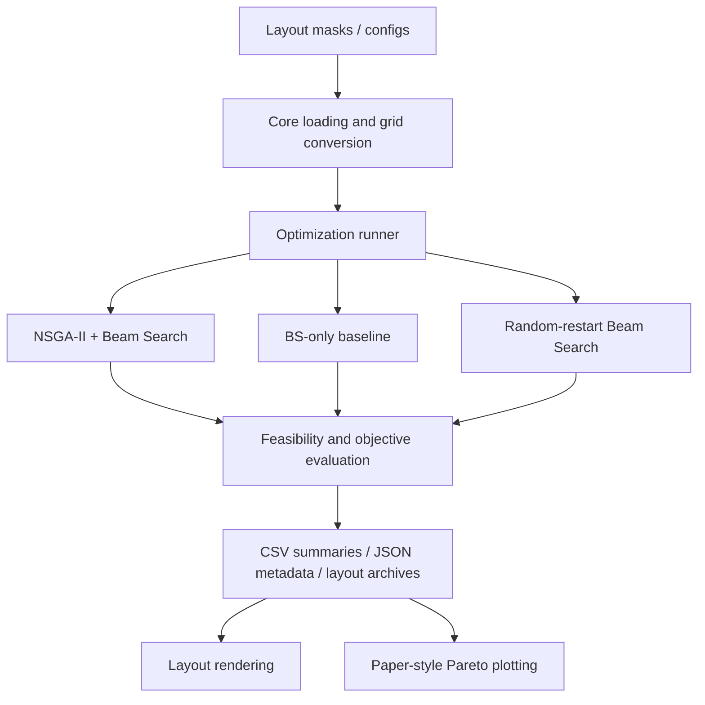

### Architecture

***TOC:***
- [1. Purpose](#1-purpose)
- [2. High-Level Workflow](#2-high-level-workflow)
- [3. Main Modules](#3-main-modules)
- [4. Method Architecture](#4-method-architecture)
- [5. Public Command Architecture](#5-public-command-architecture)
- [6. Data Flow Diagram](#6-data-flow-diagram)
- [7. Editor and Visualization Separation](#7-editor-and-visualization-separation)
- [8. Operational-layer Diagnostic Separation](#8-operational-layer-diagnostic-separation)
---

## 1. Purpose

This repository implements a structural warehouse layout optimization workflow. Layouts are represented as grid masks, candidate structural layouts are decoded with Beam Search, and the proposed search method combines NSGA-II population search with Beam Search decoding.

The public release focuses on **structural layout optimization**. It also includes an **optional operational-layer diagnostic** package for the **fixed L1-L4** representative layouts used in the paper. That diagnostic package is post-optimization only and is not part of the structural objective function.

## 2. High-Level Workflow

1. Load a warehouse mask or layout instance.
2. Convert the mask bundle to a grid representation.
3. Generate or read optimization parameters from CLI arguments, config files, or `auto_from_instance`.
4. Run the proposed NSGA-II + Beam Search method or a baseline method.
5. Evaluate feasibility and structural objectives.
6. Save CSV summaries, JSON metadata, and optional layout archives.
7. Render selected layouts or generate paper-style Pareto plots.

## 3. Main Modules

| Folder | Purpose | Key responsibilities | Layer |
|---|---|---|---|
| `apps/` | User-facing applications | Tkinter layout editor launcher and editor backends for creating, editing, and previewing mask files | application/editor layer |
| `configs/` | Repository configuration | Layout registry/config files and experiment plan defaults | configuration/data layer |
| `data/` | Repository data | Layout mask `.npz` files, plotting CSV inputs, and other non-generated public data | data layer |
| `docs/` | Public documentation | CLI, architecture, input/output, layout data, and benchmark source notes | documentation layer |
| `whl_core/` | Shared core utilities | Mask loading/saving, grid conversion, scoring, feasibility, connectivity, blocks, paths, and registry helpers | core logic |
| `whl_algorithms/` | Optimization primitives | Beam Search, chromosomes, mutation/crossover helpers, NSGA-II utilities, selection, sorting rules, and auto-parameter policy | core algorithm layer |
| `whl_experiments/` | Public runners and experiment orchestration | Main experiment manager, method-specific implementation modules, archive saving, layout archive rendering helpers, and preview helpers | runner layer |
| `whl_visualization/` | Visualization utilities | Layout plotting and paper-style Pareto/objective-space plotting from prepared CSV inputs | visualization layer |

## 4. Method Architecture

The proposed method uses NSGA-II to control population-level search. Candidate chromosomes encode structural aisle-carving choices used to produce candidate warehouse layouts.

Beam Search decodes and evaluates chromosome-derived structural choices into layout candidates. Feasibility checks and objective calculations are shared through `whl_core` modules so the proposed method and baselines use the same structural evaluation logic where applicable.

The included baselines are:

- BS-only baseline.
- Random-restart Beam Search baseline.

These baselines are structural optimization baselines. OPL is not part of the optimization workflow or objective calculation; it is an optional post-optimization diagnostic layer for selected paper layouts.

## 5. Public Command Architecture

`whl_experiments/run_experiment_manager.py` is the main public runner. It is the recommended interface for:

- `proposed_nsga2_bs`
- `bs_only`
- `random_restart_bs`

Direct runner and implementation modules are kept for developer checks and internal reuse, but they are not the recommended public workflow for most users.

Rendering and plotting are separate from optimization. Archive rendering operates on saved `.npz` layout archives and index JSON files. Paper-style Pareto plotting operates on prepared CSV inputs.

See `docs/cli_commands.md` for commands.

Optional operational-layer diagnostics are documented separately in `docs/operational_layer.md`.

## 6. Data Flow Diagram

## 7. Editor and Visualization Separation

The Tkinter editor is for creating, editing, and previewing warehouse mask files. It uses the original grid-preview behavior for interactive mask work.

Paper-style rendering and Pareto plotting are separate visualization tools. Editor preview should not be confused with manuscript-style layout plots or paper-style Pareto plots.

## 8. Operational-layer Diagnostic Separation

The optional OPL package is stored under `data/operational_layer/` and documented in `docs/operational_layer.md`. It is a post-optimization diagnostic workflow for the fixed L1-L4 paper layouts. It does not modify optimizer behavior, does not contribute to structural fitness values, and does not feed results back into NSGA-II, Beam Search, BS-only, or random-restart Beam Search.
